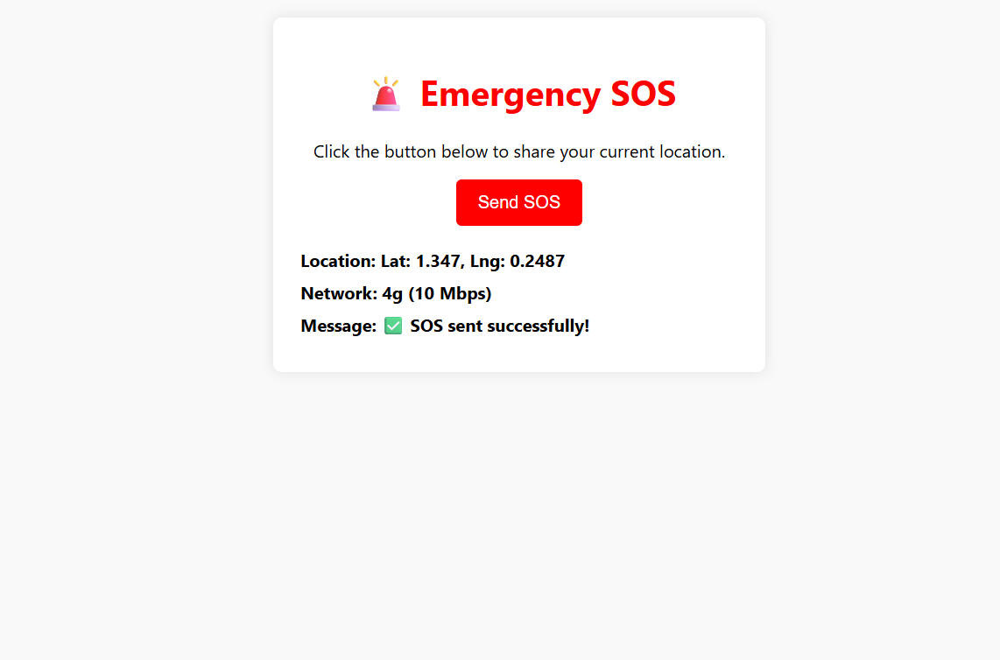

# sos_message
# 🚨 Emergency SOS

A simple web widget to share your current location and send an SOS alert.

---

## 🔍 Demo



---

## 🧩 Features

- ✅ Fetches and displays the user’s current latitude and longitude  
- 🛰️ Retrieves network status (e.g. “4g (10 Mbps)”)  
- 📡 Generates a Google Maps locational link  
- 🚨 Sends an SOS alert via `sendAlert(link)`  
  
---

## 🛠️ Tech Stack

- Vanilla **HTML**, **CSS**, **JavaScript**  
- Browser **Geolocation API** for position  
- **Network Information API** for connection status  
- UI styled with basic CSS (no frameworks)

---

## ⚙️ How It Works

1. User clicks **Send SOS**.  
2. App fetches location (`navigator.geolocation.getCurrentPosition`).  
3. Network speed retrieved with `navigator.connection`.  
4. UI updates:
   - Displays lat/lng (rounded to 4 decimals)  
   - Shows network type & downlink speed  
   - Displays a green check ✅ or error 🔴 message  
5. `sendAlert(link)` is called to dispatch the SOS with map link.

---

## 🚀 Installation & Usage

1. **Clone or download** this repo.  
2. Place the `index.html`, CSS, JS, and screenshot in the same directory.  
3. Serve locally—e.g.:

   ```bash
   npx http-server
